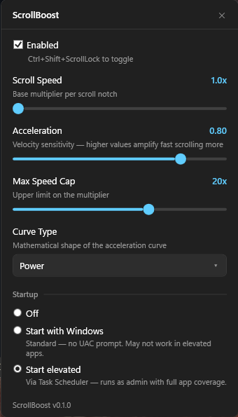

# ScrollBoost

Configurable scroll acceleration for Windows 11. Makes your mouse wheel velocity-aware — slow scrolling stays precise, fast flicks cover more ground.

## Features

- **Velocity-based acceleration** — scroll speed scales with how fast you flick the wheel
- **Three curve types** — Sigmoid (smooth, self-capping), Power (progressive), Linear (constant multiplier)
- **System-wide** — works across all Windows apps including UWP, WinUI, and elevated windows
- **Zero-lag architecture** — uses `PostMessage` directly to target windows instead of the traditional suppress-and-reinject pattern, eliminating the double hook-chain traversal that causes scroll lag in other tools
- **Windows 11 themed UI** — dark/light mode settings popup with adaptive tray icon
- **Portable** — single EXE, config file next to it, no installer needed
- **Global hotkey** — Ctrl+Shift+ScrollLock to toggle on/off
- **Ctrl+Scroll zoom** — modifier keys are preserved, so Ctrl+Scroll zoom works in browsers/editors

## Screenshot



| Setting | Range | Default | Description |
|---------|-------|---------|-------------|
| Scroll Speed | 1x – 5x | 1.5x | Base multiplier applied to every scroll event |
| Acceleration | 0.0 – 1.0 | 0.4 | How aggressively speed ramps up with velocity |
| Max Speed Cap | 2x – 30x | 12x | Upper bound on the scroll multiplier |
| Curve Type | Linear / Power / Sigmoid | Sigmoid | Acceleration curve shape |

## Installation

1. Download `ScrollBoost.exe` from [Releases](https://github.com/RaduPrusan/ScrollBoost/releases)
2. Place it anywhere (Desktop, a tools folder, etc.)
3. Run it — UAC will prompt for admin rights (needed to intercept scroll in elevated windows)
4. A mouse icon appears in the system tray

No .NET runtime needed — the EXE is fully self-contained.

## Building from Source

Requires [.NET 9 SDK](https://dotnet.microsoft.com/download/dotnet/9.0).

```bash
# Build
dotnet build src/ScrollBoost -c Release

# Run tests
dotnet test

# Publish single-file EXE
dotnet publish src/ScrollBoost -c Release -r win-x64 --self-contained true -p:PublishSingleFile=true
```

The published EXE is at `src/ScrollBoost/bin/Release/net9.0-windows/win-x64/publish/ScrollBoost.exe`.

## Configuration

Settings are stored in `config.json` next to the EXE. Editable by hand or through the tray popup.

```json
{
  "configVersion": 1,
  "defaultProfile": {
    "baseMultiplier": 1.5,
    "curveType": "sigmoid",
    "acceleration": 0.4,
    "maxMultiplier": 12.0
  },
  "appProfiles": {},
  "gestureTimeoutMs": 250,
  "smoothingAlpha": 0.3,
  "velocityWindowSize": 4,
  "enabled": true,
  "startWithWindows": false
}
```

**Advanced settings** (config.json only):
- `gestureTimeoutMs` — time between scroll events before velocity resets (default 250ms)
- `smoothingAlpha` — EMA smoothing factor for velocity detection (0.0–1.0, default 0.3)
- `velocityWindowSize` — number of events in the velocity ring buffer (default 4)

## How It Works

1. A `WH_MOUSE_LL` hook on a dedicated thread intercepts `WM_MOUSEWHEEL` events
2. Velocity is computed from inter-event timing using a ring buffer + exponential moving average
3. The selected acceleration curve maps velocity to a scroll multiplier
4. The original event is suppressed and a modified `WM_MOUSEWHEEL` is sent directly to the target window via `PostMessage`

Using `PostMessage` instead of `SendInput`/`mouse_event` is the key performance insight — it bypasses the hook chain entirely, eliminating the double-traversal latency that plagues other scroll modification tools.

## Architecture

```
ScrollBoost.exe
├── Hook/MouseHookManager      WH_MOUSE_LL on dedicated thread
├── Acceleration/
│   ├── VelocityTracker         Ring buffer + EMA velocity detection
│   ├── AccelerationEngine      Composes velocity + curve → modified delta
│   └── Curves                  Sigmoid, Power, Linear
├── Profiles/
│   ├── AppConfig               JSON config load/save
│   └── ProfileManager          Per-app profile lookup
│   └── AutoStartManager        Registry Run key + Task Scheduler
├── Interop/NativeMethods       Win32 P/Invoke declarations
└── UI/
    ├── SettingsPopup            WPF popup with dark/light theming
    ├── TrayIconHelper           DPI-aware icon generation matching system theme
    └── HotkeyForm              Global hotkey handler (Ctrl+Shift+ScrollLock)
```

## License

MIT
